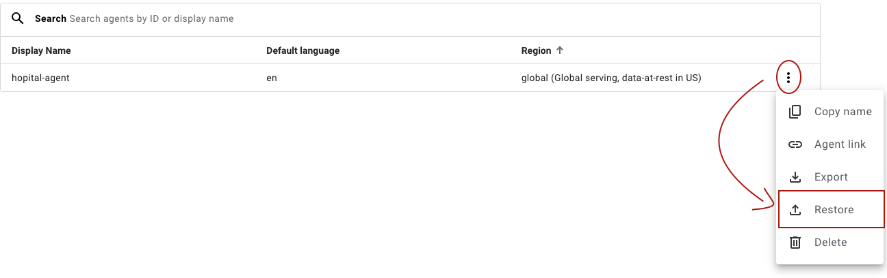

# Criação de um Agente Virtual Médico

O agente virtual desenvolvido no Dialogflow é projetado para fornecer respostas precisas e úteis sobre COVID-19 e saúde mental. Ele emprega um conjunto robusto de FAQs armazenadas no Google Cloud Storage e acessadas através do Google Cloud Data Storage. Essa integração garante que o agente possa acessar as informações mais atualizadas e fornecer respostas confiáveis aos usuários.

### Ferramentas Utilizadas
- **Generative Fallback**: Utilizado para permitir que o agente lide com qualquer tipo de entrada do usuário no início do diálogo.
- *Generators*: Empregado para traduzir a fala do agente com base na entidade "language" fornecida pelo usuário.
- **Data Store**: Configurado para automatizar as respostas FAQ com base nos arquivos .csv armazenados no Cloud Storage.

### Pré-requisitos
- Ter uma conta no Google Cloud
- Ter o arquivo **agent_hospital-agent.zip**, que contém o agente virtual configurado (encontra-se nesse repositório)

### Criando a Cloud Function
Para criar a Cloud Function e enviar os arquivos .csv, execute o seguinte código no terminal (Observação: é necessário ter o gcloud instalado):

```sh
#!/bin/bash

# Configurando o uso da GCP localmente
gcloud auth login
gcloud projects list
gcloud config set project <PROJECT_ID>
gcloud config list

# Criando o cloud storage, habilitando o versionamento e copiando os arquivos para o storage
gsutil mb -l us -c standard -b on --pap enforced gs://faq-covid-19-dialogflow
gsutil versioning set on gs://faq-covid-19-dialogflow

gsutil mb -l us -c standard -b on --pap enforced gs://faq-mental-health-dialogflow
gsutil versioning set on gs://faq-mental-health-dialogflow

gsutil cp ./files/files_gold/covid_19/* gs://faq-covid-19-dialogflow
gsutil cp ./files/files_gold/mental-health/* gs://faq-mental-health-dialogflow
```

### Configurar o Agente Virtual
- Primeiro, vamos acessar <a href="https://dialogflow.cloud.google.com/cx/">Dialogflow CX</a>
- Selecione o projeto atual (se não houver, crie um na <a href="https://console.cloud.google.com/">Console da Google Cloud </a>).
- Clique em "Create Agent".
- Selecione "Build your own".
- Atribua um nome, defina a "Location" como **Global** e clique em "Create".
- Após a criação, volte para o <a href="https://dialogflow.cloud.google.com/cx/">Dialogflow CX</a>, selecione o projeto e vá para os três pontos do agente virtual criado, clique em Restore.
- Selecione "Upload" e carregue o arquivo zip agent_hospital-agent.zip.
- Clique em "Restore".




O agente virtual está configurado com sucesso.

### Criando o Data Store
Apesar de termos configurado o Agente virtual, ele ainda não está conectado a nenhum Data Store.

Para criar, vamos:Para criar, siga os passos abaixo:

Para criar, siga os passos abaixo:
- Vá para o <a href="https://dialogflow.cloud.google.com/cx/">Dialogflow CX</a>
- Abra o agente configurado.
- Selecione um dos fluxos (para esse passo-a-passo, selecione o "flow-covid19").
- Clicar no Start Page
- Clique em "Add State Handler" e habilite o Data Store.


- Agora, clique no "+" ao lado do Data Store.
- Na seção Data Store, clique em **Create Vertex AI Search and Conversation App**.


Você será redirecionado para o <a href="https://console.cloud.google.com/gen-app-builder">Agent builder</a>
- Atribua o nome **faq-covid** em "Company name" e clique em "CONTINUE".
- Clique em **CREATE DATA STORE**
- Selecione Cloud Storage e depois em CONTINUE
- Clique em "BROWSE" e selecione o Cloud Storage **faq-covid-19-dialogflow**
- Selecione **CSV for structured FAQ data (only for chat)** e  clique em "CONTINUE".


- Deixe a Localização como global e atribua o nome **faq-covid**
- Clique em "CREATE".

Após a criação, selecione o Data Store criado e clique em "CREATE" para criar o aplicativo no Agent Builder.

Depois de criado, você será direcionado para a seguinte tela:


Clique em "New Data Store" e repita o mesmo processo para criar um Data Store chamado faq-mentalhealth, usando a Cloud Storage **faq-mental-health-dialogflow**

### Conectando o Data Store no Dialogflow
Voltando para o <a href="https://dialogflow.cloud.google.com/cx/">Dialogflow CX</a>, recarregue a página para que o Data Store apareça.

> Observação: Talvez seja necessário habilitar o Data Store no "Add State Handler" novamente.

- Clique no "+" ao lado do Data Store.
- Na seção Data Store, vá para o campo "FAQ documents" e selecione o faq-covid.


### Traduzindo com Base no Input do Usuário

Agora, para traduzir todas as respostas do chatbot com base na linguagem escolhida pelo usuário:
- Na mesma tela, vá para "Generators".
- Selecionar o **translate_choose_lenguage**
- No campo Text, insira **$request.knowledge.answers[0]**
  - O campo Text é especificado na configuração do Generator.
  - O parâmetro **$request.knowledge.answers[0]** é a resposta do Agente com base no Data Store configurado.
- No campo Language, insira **$session.params.lenguage**
  - O campo Language também é especificado na configuração do Generator
  - O Parametro **$session.params.lenguage** é a entidade configurada para receber a linguagem fornecida pelo usuário na intenção
- No campo Output parameter, insira o nome **$request.generative.output**
  - Este parâmetro é a resposta do Generator, e o nome é opcional.
- Por fim, insira a resposta do Generator em "Agent Says".


Clique em "Save" e repita o mesmo processo no fluxo **flow-healthmental**

### Testando
> Observação: É necessário aguardar que a integração esteja completa e as permissões estejam configuradas corretamente para que o teste seja efetivo.

Clique em "Test Agent" para testar o Agente virtual criado.

Teste na seguinte ordem:
- "Oi"
- "Meu nome é Júlio"
- "Quero Português"
- "Vamos falar sobre o COVID-19"
- "O que é o COVID-19?"
- "Quais são os sintomas?"
- "Agora vamos falar sobre saúde mental"
- "Qual a importância da saúde mental?"


